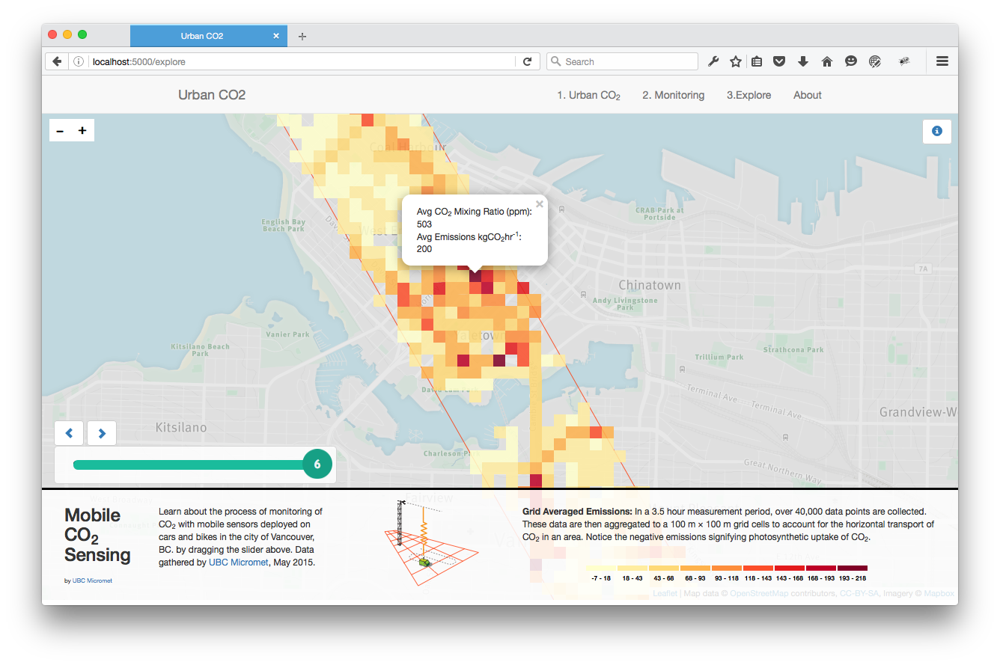

# Urban CO2

[](https://gitter.im/joeyklee/urbanco2?utm_source=badge&utm_medium=badge&utm_campaign=pr-badge&utm_content=badge)

## About



This is an interactive web app to communicate the importance of cities as sources of CO2 emissions. The project will highlight the potential use of mobile sensors to monitor CO2 in the city and also allow people to access the data that describes the CO2 emissions for the city of Vancouver, BC.

As part of a Mozilla Science Fellowship Sprint, we are working to help communicate scientific research using visualization and the web.


## Setup

This page is built on [Node.js]() and a handful of other handy technologies. Please follow the following steps to get setup.

I took the setup documentation from:

* [Setup nodejs with homebrew on osx](https://changelog.com/install-node-js-with-homebrew-on-os-x/)
* [setup mongodb with homebrew on osx](https://docs.mongodb.org/manual/tutorial/install-mongodb-on-os-x/)

### On OSX:
(IF YOU ALREADY HAVE NODE JS AND MONGODB INSTALLED SKIP TO THE DEPENDENCIES SECTION)
#### Homebrew

Fire up your terminal:

```
ruby -e "$(curl -fsSL https://raw.githubusercontent.com/Homebrew/install/master/install)"
```

Make sure your system is up to date by running:

```
brew update
```

As a safe measure, run brew doctor to make sure your system is ready to brew. Follow any recommendations from brew doctor.

```
brew doctor
```

you will have to then add homebrew to your computer's system path by pasting this into your terminal:

```
export PATH="/usr/local/bin:$PATH"
```

#### Install Node

You can now install node:

```
brew install node
```

Technically now you're ready to build the project, however, let's install a handy Node module that allows us to automagically update our server each time we save our server.js file. This module is called ```nodemon``` and we can install it like so:

```
npm install -g nodemon
```

If you're new to node the ```-g``` flag allows you to access that package globally in the terminal. You'll see how this works when we run our server. 

#### Install Mongodb

We will use mongodb as our project database. You can install it using homebrew as well. Again, in your terminal run:

```
brew update
brew install mongodb
```

Now you will have a mongodb database setup on your computer. 


## Dependencies

#### Install project dependencies
Install the dependencies listed in the ```package.json```. You will use the ```npm install``` command in your terminal in the project directory. 

Fire up your terminal and:

```
cd urbanco2
npm install
```


## Run 

We will have to do 3 things:

1. Start our mongodb
2. Run our node server.

In the terminal. Run:

```
sudo mkdir -p /data/db  # creates the mongodb data directory if it doesn't already exist
sudo chown -R $USER /data/db # give username access to this
mongod # run the database
```

This will start our mongodb database running on our computer. We can then access the running mongodb database we create for the project from our node.js server.


### Import data into your mongodb
We use a few datasets for this webapp that we store in the mongodb database. In order to get those datasets in, you can use these import commands into your terminal:

```
cd urbanco2/data
sh import-traffic.sh
sh import-points.sh
sh import-grid.sh
```
* ```sh``` invokes a shell script 
* ```import-traffic.sh``` is the shell script that calls the ```geojson2mongo.js``` node script to take the geojson traffic data and import it into the db. 


Next **in another terminal window**, ```cd urbanco2``` and run:

```
nodemon server.js
```
Visit http://localhost:5000/

*** 
more soon!
